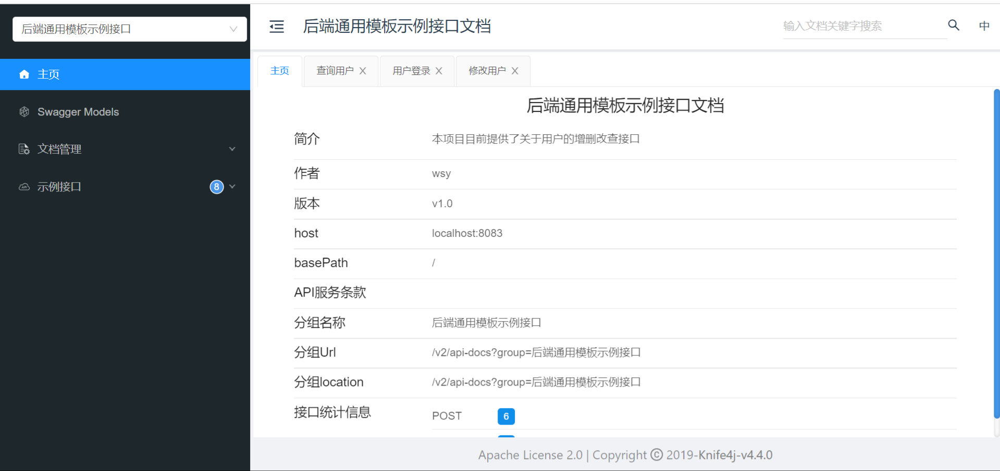

# Spring Boot 后端通用模板

**@author wsy**

## 特点

> 集成Spring Boot 2.7.6、Spring MVC、Spring Boot AOP、MySQL 、Mybatis-Plus 3.5.7、Hutool 5.8.26、knife4j 4.4.0

**省去繁琐选择依赖的过程，基本做到应有既有，开箱即用！**

## 使用方式

1. 克隆当前仓库到本地

   ```shell
   git clone
   ```

2. 使用IDE（如IntelliJ IDEA）打开本项目

3. 等待下载Maven依赖

4. 修改**application.yml**文件中的配置

   ```yml
   # 应用服务 WEB 访问端口
   server:
     port: 8083
     servlet:
       # session存储时间
       session:
         timeout: 14400
   spring:
     # 数据库配置
     datasource:
       driver-class-name: com.mysql.cj.jdbc.Driver
       url: 你的数据库地址
       username: 你的数据库用户名
       password: 你的数据库密码
   
   #接口文档配置
   knife4j:
     enable: true
     openapi:
       title: 后端通用模板示例接口文档(你的接口文档名称)
       description: "本项目目前提供了关于用户的增删改查接口"(你的接口文档描述)
       concat: 你的名字
       version: v1.0
       group:
         test1:
           group-name: 后端通用模板示例接口
           api-rule: package
           api-rule-resources:
             - com.wsy.commonbackend.controller
   
   #加密盐值
   salt: 你准备的加密盐值
   ```

5. 使用项目中的sql文件在本地数据库建表

6. 启动项目，在浏览器地址栏中输入**http://localhost:8083/doc.html**，如若打开此页面，则代表项目初始化成功：

   

7. 在接口文档右侧的示例接口中选取接口在线调试即可

## 功能

1. **AOP权限校验**

   定义了**AuthCheck注解**类，接收一个**int数组**，权限可以在**constants/ComConstant.java**中定义自己的权限常量。

   **使用时**可以在Controller中的方法上加上AuthCheck注解，传入权限数组，即可使用AOP校验权限。本项目实现了多权限校验，即用户拥有必须权限之一即可访问该接口。

   **使用方式：**

   ```java
       /**
        * 删除用户
        * @param idDTO id请求类
        * @return 是否删除成功
        */
       @AuthCheck(auth = {ComConstant.ADMIN_USER}) //多个权限用逗号分隔即可
       @ApiOperation("删除用户")
       @PostMapping("/deleteUser")
       public BaseResponse<Boolean> deleteUser(@RequestBody IdDTO idDTO) {
           return ResultUtil.success(sampleService.deleteUser(idDTO));
       }
   ```

   **注意，因为此注解接收一个权限数组，所以只有一个权限时也需要用{}传入**

2. **统一返回类型**

   **成功**

   ```json
   {
       "code":0,
       "msg":"ok",
       "data": {
           "数据1":"数据1"
       }
   }
   ```

   **失败**

   ```json
   {
       "code":"数字类型错误码",
       "msg":"错误信息",
       "data": null
   }
   ```

3. **全局异常处理**

4. **knife4j接口文档**